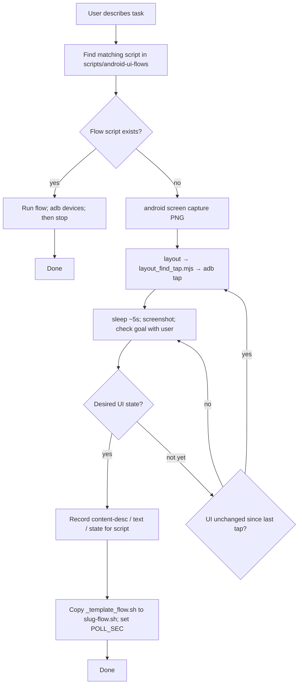

# android-cli-layout-tap

Skill for automating the Android emulator from the terminal: dump accessibility layout as JSON, resolve tap coordinates, and send taps with **adb**. Intended for this repo’s **record → replay** UI flows under `scripts/android-ui-flows/`.

## Requirements

- **ADB** on your `PATH` (typically `$ANDROID_SDK_ROOT/platform-tools`).
- **Node.js** (`node` on `PATH`) for **`layout_find_tap.mjs`** — resolves taps from layout JSON (fast path vs piping raw dumps through the model).
- **Android CLI** `android` — [official install](https://developer.android.com/tools/agents/android-cli). This repo often uses `~/bin/android` after installing the binary.
- One target device or emulator; use `adb devices` and `-s <serial>` when multiple devices are connected.

On macOS, the SDK is often `~/Library/Android/sdk`. If the CLI picks the wrong SDK, use `android info` or `--sdk=…`.

## Record → replay flow

How exploration becomes a checked-in bash flow when automating the emulator from an agent:

Agent procedure (same flow, with commands and pitfalls): [SKILLS.md](./SKILLS.md).

## What gets checked in

Reusable automation lives in **`scripts/android-ui-flows/*.sh`** (repo root). New flows start from **`scripts/android-ui-flows/_template_flow.sh`**. Tap/layout helpers live under **`.agents/skills/android-cli-layout-tap/scripts/`** — set **`SK`** to that path from the repo root; primary entry is **`layout_cli.sh`** (**tap**, **coords**, **labels**, **dump**, **batch-tap**). Thin wrappers delegate there. **`layout_find_tap.mjs`** supports **`--batch-json`**. Repo-root **`scripts/metro_dev_*.sh`** pair Metro dev maps with **`metro-symbolicate`**; **`scripts/build_android_app.sh`** + **`app/dist/native-sourcemaps/android/*.map`** cover **embedded** APKs — see **SKILLS.md** → **Agent learnings: JS symbolication**. For **jank → thread layer** (gfxinfo / Perfetto), see **`docs/android-performance-diagnostics.md`**.

## External links

- [Android CLI overview](https://developer.android.com/tools/agents/android-cli) — `layout`, `screen capture`, emulator, `docs search`, `init`, `skills`.
- [Android CLI walkthrough (video)](https://www.youtube.com/watch?v=MLDkhDyvTVI) — terminal-first agent workflow, layout vs heavy XML dumps, optional annotate→resolve taps.
