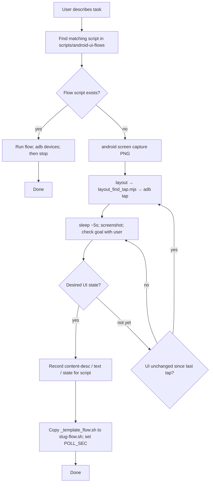

# android-cli-layout-tap

Skill for automating the Android emulator from the terminal: dump accessibility layout as JSON, resolve tap coordinates, and send taps with **adb**. Intended for this repo’s **record → replay** UI flows under `scripts/android-ui-flows/`.

## Requirements

- **ADB** on your `PATH` (typically `$ANDROID_SDK_ROOT/platform-tools`).
- **Node.js** (`node` on `PATH`) for **`layout_find_tap.mjs`** — resolves taps from layout JSON (fast path vs piping raw dumps through the model).
- **Android CLI** `android` — [official install](https://developer.android.com/tools/agents/android-cli). This repo often uses `~/bin/android` after installing the binary.
- One target device or emulator; use `adb devices` and `-s <serial>` when multiple devices are connected.

On macOS, the SDK is often `~/Library/Android/sdk`. If the CLI picks the wrong SDK, use `android info` or `--sdk=…`.

## Record → replay flow

How exploration becomes a checked-in bash flow when automating the emulator from an agent:

Agent procedure (same flow, with commands and pitfalls): [SKILLS.md](./SKILLS.md).

## What gets checked in

Reusable automation lives in **`scripts/android-ui-flows/*.sh`**. New flows start from **`scripts/android-ui-flows/_template_flow.sh`**. Bundled helpers live in **`scripts/`** next to this README (**`layout_find_tap.mjs`**, `layout_stream_tap.sh`, plus tap-run, dump-to-file, label listing, screenshot, and boot-wait scripts — see **SKILLS.md**).

## External links

- [Android CLI overview](https://developer.android.com/tools/agents/android-cli) — `layout`, `screen capture`, emulator commands.
